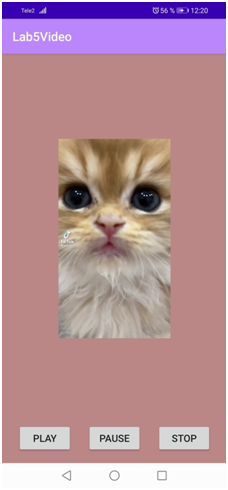

# Lab5Video
Тема: Работа с мультимедиа.
Цель: Разработать свой видео или аудио проигрыватель.
Задание: Разработать мобильное приложение для воспроизведения звука или видео.

Порядок выполнения:
1. Создаем новый проект;
2. Добавляем видео файл в проект в папку res/raw;
3. Добавляем 3 кнопки для управления и создадим для них обработчики событий; Создаем VideoView;
4. Добавляем код видео;
```kotlin
package com.example.lab5video

import android.net.Uri
import android.os.Bundle
import android.support.v7.app.AppCompatActivity
import android.view.View
import android.widget.MediaController
import android.widget.VideoView


class MainActivity : AppCompatActivity() {
    private var myvideoPlayer: VideoView? = null;

    override fun onCreate(savedInstanceState: Bundle?) {
        super.onCreate(savedInstanceState)
        setContentView(R.layout.activity_main)

        myvideoPlayer = findViewById<VideoView>(R.id.videoView)
        val myVideoUri: Uri = Uri.parse("android.resource://" + packageName + "/" + R.raw.pippop)
        myvideoPlayer!!.setVideoURI(myVideoUri)
        val mediaController = MediaController(this)
        myvideoPlayer!!.setMediaController(mediaController)
        mediaController.setMediaPlayer(myvideoPlayer)


    }

    fun onPlayClick(v: View?) {
        myvideoPlayer!!.start();
    }

    fun onPauseClick(v: View?) {
        myvideoPlayer!!.pause();
    }

    fun onStopClick(v: View?) {
        myvideoPlayer!!.resume();
    }
}
```


